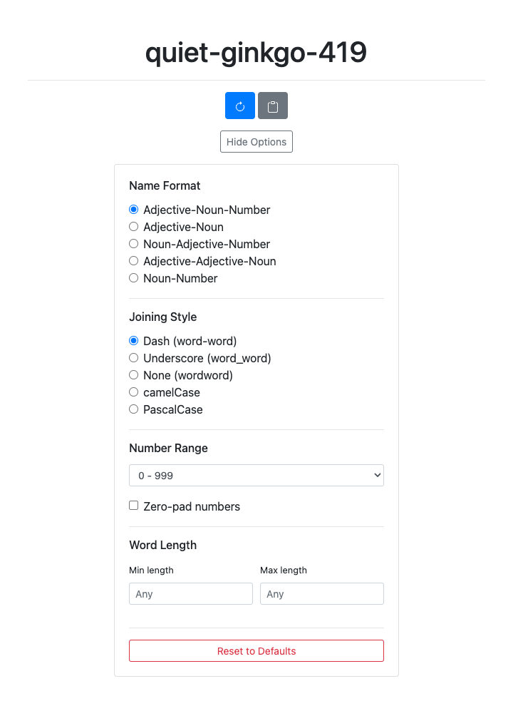

# Name-On

Name-On generates a new _Adjective-Noun-Number_ combo with each request. Useful for unique, human-readable names for projects, containers, or anything else.

Try it live: [name-on.clintcparker.com](https://name-on.clintcparker.com)


---

## Installation

### CLI

Install the `name-on` command-line tool using any of these methods:

```sh
# Homebrew
brew install clintcparker/tap/name-on

# .NET Tool
dotnet tool install -g name-on

# Shell script (Linux/macOS)
curl -fsSL https://raw.githubusercontent.com/clintcparker/name-on/main/install/install.sh | sh

# PowerShell (Windows)
irm https://raw.githubusercontent.com/clintcparker/name-on/main/install/install.ps1 | iex
```

### Web App

No installation needed. Visit [name-on.clintcparker.com](https://name-on.clintcparker.com) to use the Blazor WebAssembly app directly in your browser.

---

## CLI Usage

```
name-on [options]
```


| Option | Description | Default |
|---|---|---|
| `-n, --count <N>` | Generate N names | 1 |
| `-s, --separator <SEP>` | Separator between parts | `-` |
| `-f, --format <FORMAT>` | Name format using: `adj`, `noun`, `num` | `adj-noun-num` |
| `-v, --version` | Show version | |
| `-h, --help` | Show help | |

### Examples

```sh
name-on                         # clever-otter-123
name-on -n 5                    # Generate 5 names
name-on -s _                    # clever_otter_123
name-on -f adj-noun             # clever-otter
name-on -f noun-adj-num         # otter-clever-123
```

### Shell Completions

```sh
name-on completions bash >> ~/.bashrc
name-on completions zsh >> ~/.zshrc
name-on completions fish > ~/.config/fish/completions/name-on.fish
name-on completions powershell >> $PROFILE
```

---

## Customization Options

The web app exposes the full set of options under **Show Options**. Your choices are saved to
`localStorage`, so they persist across reloads.

- **Format templates**: `Adjective-Noun-Number` (default), `Adjective-Noun`, `Noun-Adjective-Number`, `Adjective-Adjective-Noun`, `Noun-Number`
- **Joining styles**: dash (`word-word`), underscore (`word_word`), none (`wordword`), `camelCase`, `PascalCase`
- **Number range**: `0-9`, `0-99`, `0-999` (default), or `0-9999`, with optional zero-padding
- **Word length filter**: minimum and maximum word length, with a warning when the filter leaves too few words to choose from



The CLI covers a focused subset of these: `--format` for the template and `--separator` for the
joining character. See [CLI Usage](#cli-usage) above.

---

## Architecture

Name-On is a **Blazor WebAssembly (WASM)** app that runs entirely in the browser, plus a cross-platform CLI tool. Both use a shared C# core library for name generation. There are no server-side APIs required.

### Solution Structure

- **name-on-core**: Shared C# library with the core name generation logic
- **name-on-blazor**: Blazor WASM frontend, directly references and uses `name-on-core`
- **name-on-cli**: Cross-platform command-line tool
- **name-on-unit-tests**: Unit tests for the core library
- **name-on-cli-tests**: Tests for the CLI

---

## Development

### Prerequisites

- [.NET 10.0 SDK](https://dotnet.microsoft.com/download/dotnet/10.0) (pinned in `global.json`)

### Build

```sh
dotnet build name-on.sln
```

### Test

```sh
dotnet test name-on.sln
```

### Run the Web App Locally

```sh
dotnet run --project name-on-blazor
```

---

## Roadmap

- [x] Migrate to Blazor WebAssembly (WASM) only
- [x] Remove Azure Functions and legacy static frontend
- [x] Modernize deployment for static hosting
- [x] Add customization options for name format
- [x] Add CLI tool with cross-platform installation
- [ ] Theme packs / custom word lists
- [ ] Bulk generation and export
- [ ] History and favorites

---

## License

MIT
